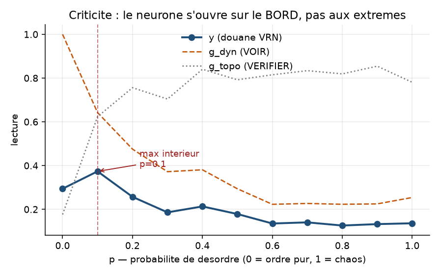
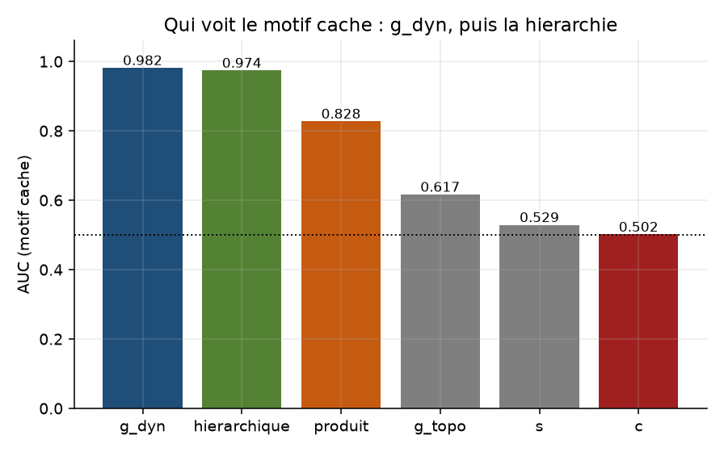
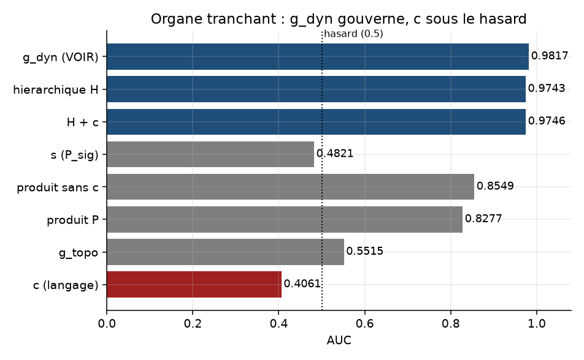
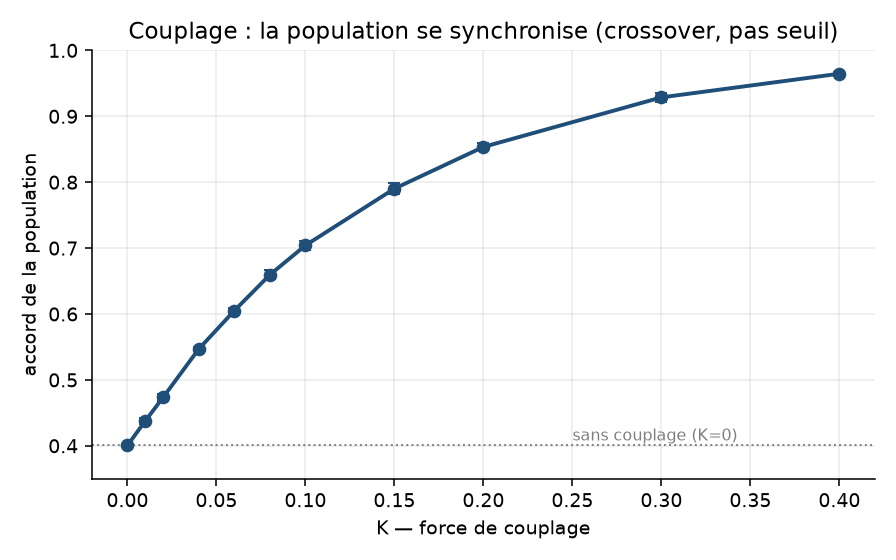
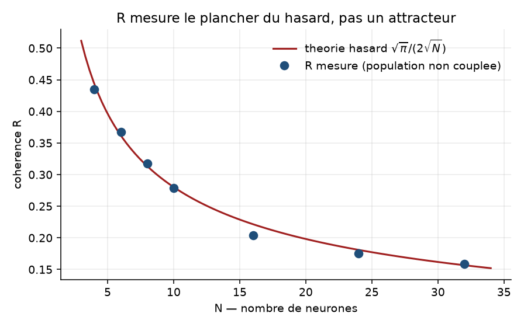
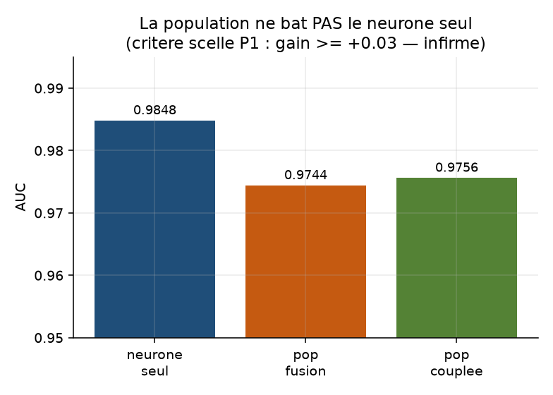
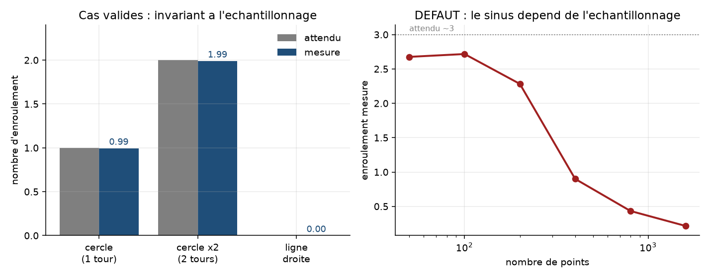

<div align="center">

# RATISS-VRN

### Réalité Virtuelle Neuronale — un neurone qui voit, vérifie et nomme

[](#statut)
[](LICENSE)
[](https://www.python.org/)
[](https://ripser.scikit-tda.org/)

**RATISS Labs** — Jonathan Evina

</div>

---

## En bref

**VRN** unifie trois lectures en un seul neurone : il **voit** (dynamique),
**vérifie** (topologie) et **nomme** (sémantique). Ce dépôt contient
l'instrumentation, les expériences et les résultats — y compris les
résultats négatifs.

État actuel : **recherche exploratoire**. Rien n'est figé. Chaque chiffre
est reproductible par un script versionné, et chaque script porte les
critères qui ont été **scellés avant** son exécution.

## Sommaire

- [Résultats](#résultats)
- [Figures](#figures)
- [Installation](#installation)
- [Structure](#structure)
- [Reproduire](#reproduire)
- [Méthode](#méthode)
- [Statut](#statut)
- [Licence](#licence)

---

## Résultats

### Le neurone détecte-t-il un ordre caché ?

Tâche : distinguer une chaîne aléatoire d'une chaîne aléatoire contenant un
motif `ATGC` caché. Métrique : AUC. Graines neuves à chaque fois.

| organe | AUC (graines 1000+) | AUC (graines 2000+) | lecture |
|---|---|---|---|
| **g_dyn — VOIR** | **0.9892** | **0.9817** | l'organe tranchant |
| y hiérarchique | 0.9845 | 0.9743 | fusion retenue |
| y produit (v0) | 0.8724 | 0.8277 | fusion diluée |
| g_topo — VÉRIFIER | 0.6168 | 0.5515 | faible seul |
| s — P_sig | 0.5292 | 0.4821 | ≈ hasard |
| c — NOMMER | 0.5017 | 0.4061 | **sous le hasard** |

**Conclusion :** la détection existe. `g_dyn` est l'organe qui tranche.
La sémantique (`c`) **ne discriminate pas** sur cette tâche et a été
**retirée du chemin de sortie** — elle reste calculée à titre de diagnostic.

### Criticité

`y(p)` présente un **maximum intérieur** vers `p ≈ 0.2-0.3` : le neurone
s'ouvre sur le **bord** entre ordre et chaos, pas aux extrêmes. Confirmé
sur 5 graines (écart-type ≈ 0.009).

### Instrumentation topologique

Le nombre d'enroulement (invariant de Poincaré) est validé sur cas à
réponse connue : cercle `0.995`, cercle ×2 `1.990`, ligne droite `0.000`.

Un **défaut connu subsiste** : sur une trajectoire de Takens de signal, la
mesure **dépend de la densité d'échantillonnage** (voir
[`JOURNAL.md`](JOURNAL.md)). Il est documenté, pas masqué.

### Population — résultat négatif

Une population stabilisée **ne bat pas** un neurone seul sur cette tâche
(0.9744 vs 0.9848). Consigné tel quel : la fusion est mesurable mais
**n'apporte pas d'information** quand les lecteurs regardent la même
entrée.

## Figures

| Criticité | Tâche motif caché |
|---|---|
|  |  |

| Hiérarchie vs produit | Couplage de population |
|---|---|
|  |  |

| Cohérence et plancher du hasard | Population vs neurone seul |
|---|---|
|  |  |

| Enroulement — cas valides et défaut |
|---|
|  |

Figures régénérables : `python figures/generer.py`.

---

## Installation

```bash
git clone https://github.com/jonathansearch/ratiss-vrn.git
cd ratiss-vrn
python -m venv .venv && source .venv/bin/activate
pip install -r requirements.txt
```

Prérequis : Python ≥ 3.11, `numpy`, `ripser`, `persim`, `matplotlib`.

> **Note** — `ripser` est **requis**. Sans lui, les mesures topologiques
> lèvent une erreur explicite plutôt que de renvoyer des zéros silencieux.
> Un instrument indisponible doit faire du bruit, pas mentir.

## Structure

```
organes/          les organes du neurone
  psig.py           P_sig — persistance topologique (ripser)
  dynamique.py      VOIR  — prédiction / JEPA
  atcg.py           VERIFIER — porte de consensus, repliement ADN
  semantique.py     NOMMER — concept
  enroulement.py    invariant d'enroulement, PLV, scripts
  neurone_vrn.py    assemblage du neurone + plasticité G
  assemblage.py     population, fusion, couplage
experiences/      exp00..exp08 — un script, un critère scellé, un .json
figures/          générateur de figures + images
docs/             notes de conception
JOURNAL.md        journal de bord : mesures, erreurs, corrections
SPEC-V0.md        spécification v0
```

## Reproduire

```bash
python experiences/exp04_criticite.py       # criticité
python experiences/exp05_tache_motif.py     # motif caché
python experiences/exp06_hierarchie.py      # opérateur de fusion
python experiences/exp07_stabilisation.py   # population, couplage
python experiences/exp08_population.py      # population vs neurone seul
python figures/generer.py                   # figures
```

Chaque expérience réécrit son `experiences/expNN_*.json` avec ses
verdicts, comparés aux critères scellés dans son en-tête.

## Méthode

Trois disciplines, tenues dans ce dépôt :

1. **Critère scellé avant mesure.** Chaque expérience écrit ses critères
   de succès dans son en-tête, avant toute exécution. Aucun ajustement
   après.
2. **Graines neuves.** Chaque expérience utilise des graines qui n'ont
   jamais servi, pour éviter de mesurer la mémoire de l'expérimentateur.
3. **Contrôle systématique.** Tout instrument a un cas à réponse connue,
   et tout instrument doit **crier** quand il est indisponible — jamais
   renvoyer zéro en silence.

Cette troisième règle a tué trois résultats faux dans ce dépôt. Ils sont
consignés dans [`JOURNAL.md`](JOURNAL.md) : un import manquant qui
produisait de faux verdicts, un test à sens unique qui figeait le système,
et une cohérence qui mesurait le plancher du hasard en se faisant passer
pour un attracteur.

## Statut

| brique | état |
|---|---|
| Instrument P_sig (ripser) | validé |
| Détection d'ordre caché | établie (`g_dyn` AUC ≈ 0.98) |
| Criticité (maximum intérieur) | établie |
| Opérateur de fusion | hiérarchique retenu |
| Enroulement | validé sur cas simples, **défaut d'échantillonnage connu** |
| Population / couplage | synchronisation réelle, **utilité non démontrée** |
| Sémantique (`c`) | **hors du chemin de sortie** |

## Licence

**Propriétaire — tous droits réservés.** Voir [`LICENSE`](LICENSE).
Dépôt **privé** : aucune redistribution sans autorisation écrite de RATISS
Labs.

---

<div align="center">

**RATISS Labs** — *la dynamique voit, la topologie vérifie, la sémantique nomme.*

</div>
